# Product Management API

A RESTful API for managing products with CRUD operations, documented with Swagger UI.

## Setup

### 1. Install Packages
```bash
npm install express mongoose swagger-jsdoc swagger-ui-express dotenv cors
```

### 2. Configure Environment
Create a `.env` file:
```env
PORT=3000
API_KEY=your_secret_key
```

Source the environment variables:
```bash
source .env
```

### 3. Start the Server
```bash
npm start
```
Server runs at: `http://localhost:3000`  
Swagger UI: `http://localhost:3000/api-docs`

---
## Landing Page at http://localhost:3000

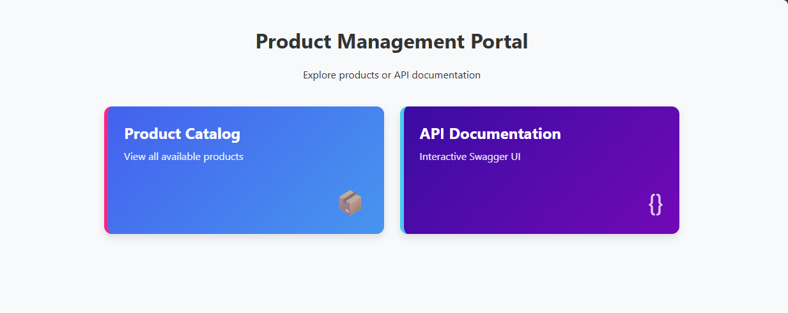

## CLI Workflow

### 1. List All Products
```bash
curl -H "Accept: text/plain" http://localhost:3000/api/products
```
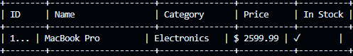
### 2. Create Two Products
```bash
curl -X POST http://localhost:3000/api/products \
  -H "Content-Type: application/json" \
  -H "X-API-Key: ${API_KEY}" \
  -d '{
    "name": "iPad Pro",
    "price": 1099.99,
    "category": "Electronics",
    "inStock": true
  }'

curl -X POST http://localhost:3000/api/products \
  -H "Content-Type: application/json" \
  -H "X-API-Key: ${API_KEY}" \
  -d '{
    "name": "AirPods Pro",
    "price": 249.99,
    "category": "Accessories",
    "inStock": true
  }'
```
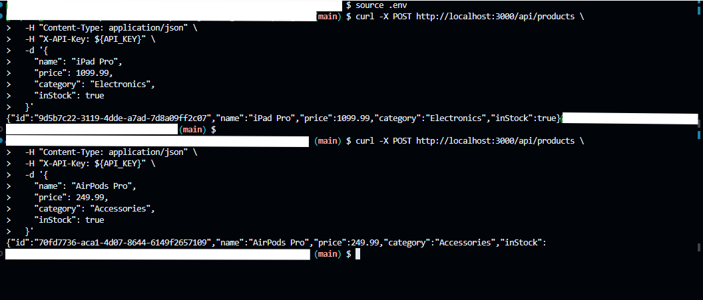 

## Check Updated products
```bash
curl -H "Accept: text/plain" http://localhost:3000/api/products
```
+--------+---------------------+---------------+-----------+----------+
| ID     | Name                | Category      | Price     | In Stock |
+--------+---------------------+---------------+-----------+----------+
| 1... | MacBook Pro         | Electronics   | $ 2499.99 | ✓        |
| 9d5b7c... | iPad Pro            | Electronics   | $ 1099.99 | ✓        |
| 70fd77... | AirPods Pro         | Accessories   | $  249.99 | ✓        |


### 3. Update Product Price
```bash
curl -X PUT http://localhost:3000/api/products/1 \
  -H "Content-Type: application/json" \
  -d '{"price":1199.99}'
```
 

## Check Updated products
```bash
curl -H "Accept: text/plain" http://localhost:3000/api/products

```

+--------+---------------------+---------------+-----------+----------+
| ID     | Name                | Category      | Price     | In Stock |
+--------+---------------------+---------------+-----------+----------+
| 1... | MacBook Pro         | Electronics   | $ 2299.99 | ✓        |
| 9d5b7c... | iPad Pro            | Electronics   | $ 1099.99 | ✓        |
| 70fd77... | AirPods Pro         | Accessories   | $  249.99 | ✓        |
+--------+---------------------+---------------+-----------+----------+

### 4. Delete a Product
```bash
curl -X DELETE http://localhost:3000/api/products/70fd7736-aca1-4d07-8644-6149f2657109 \
  -H "X-API-Key: ${API_KEY}"
```
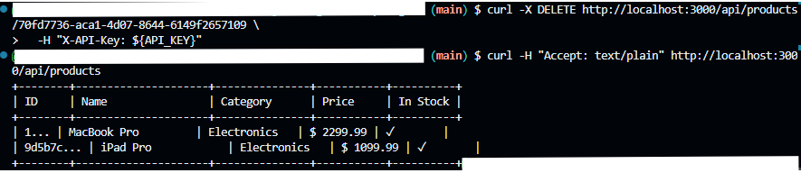 

---

## Swagger UI Workflow

### 1. Access Swagger UI

Click on API Documentation Card on Landing Page 

or

Visit `http://localhost:3000/api-docs` in your browser.  

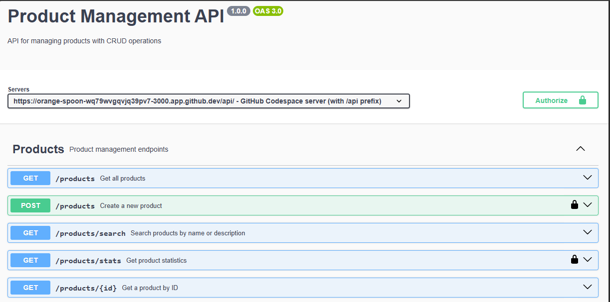 
### 2. Authorize
Click "Authorize" and enter your API key.  
 <!-- Attach your image here -->

### 3. Execute Operations
- **GET /products**: List all products  
  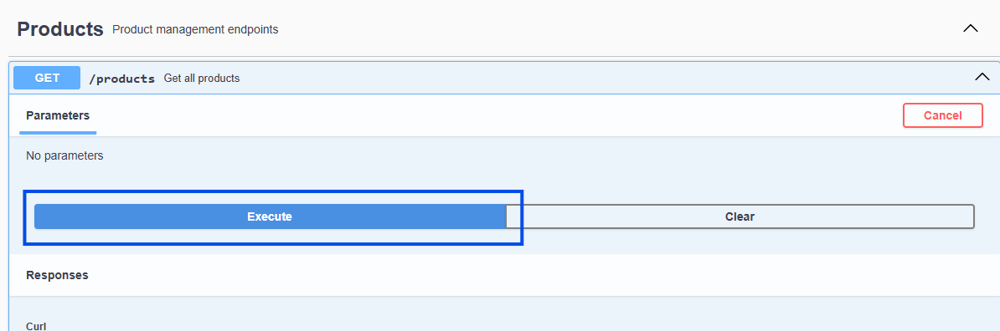

  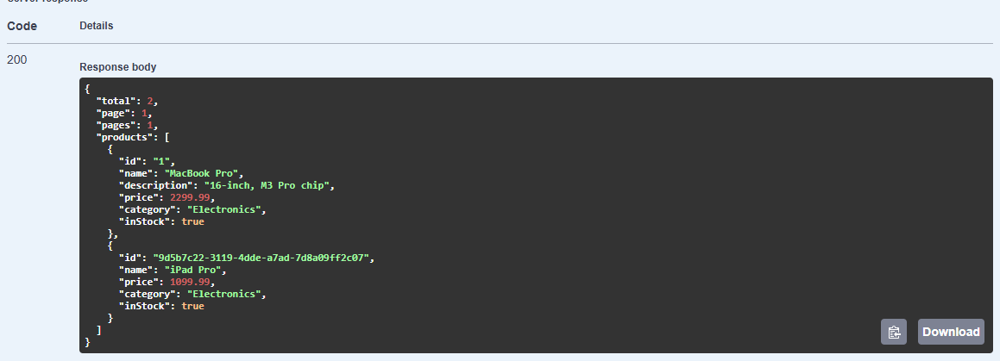

- **POST /products**: Create new products  
  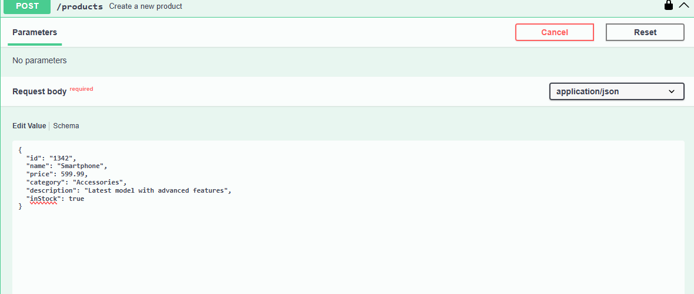
  
- **GET /product**: Get product by name  
  

  ** Output
  

- **PUT /products/{id}**: Update a product  
  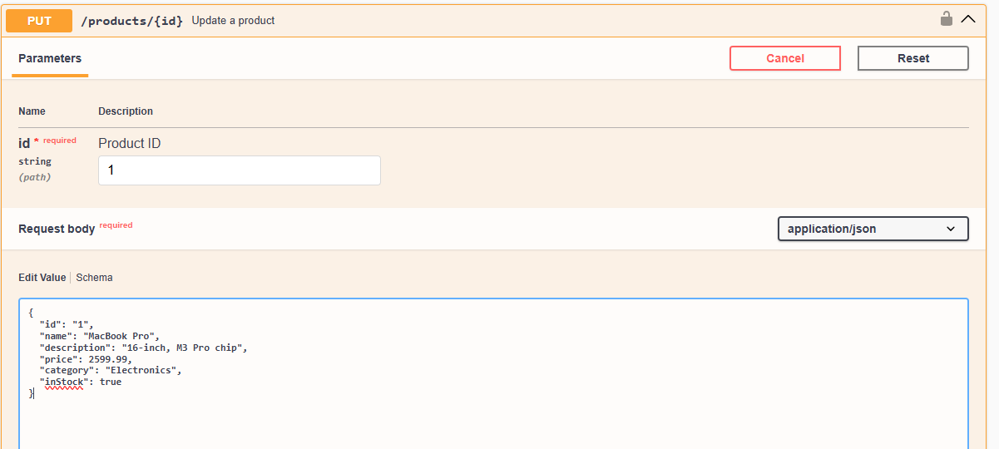
  
  **Output

  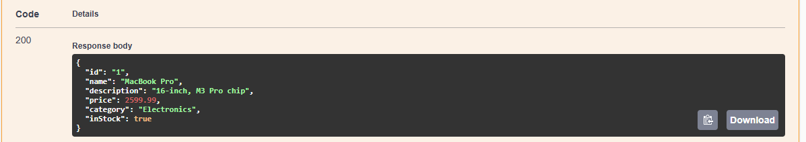

- **DELETE /products/{id}**: Remove a product  
  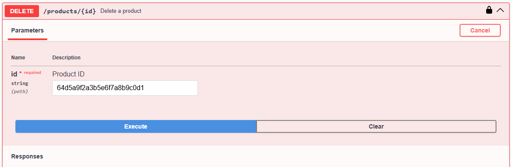

---

## Troubleshooting
- **404 Errors**: Ensure routes include `/api` prefix
- **401 Errors**: Verify `X-API-Key` header is set
- **CORS Issues**: Confirm `app.use(cors())` is enabled
```

